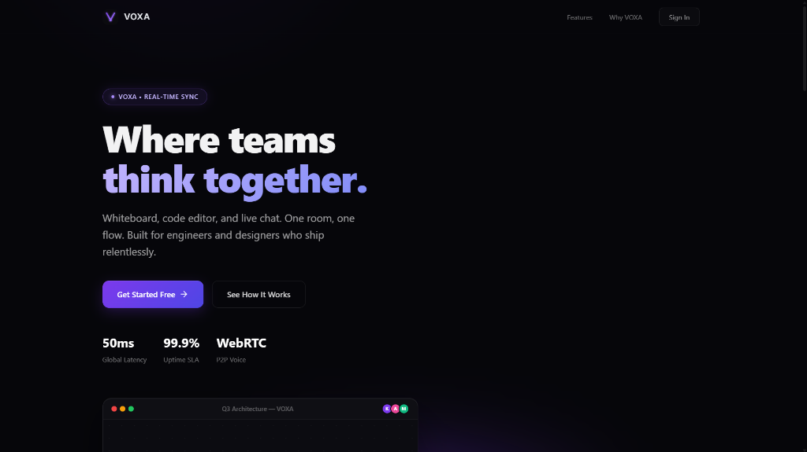
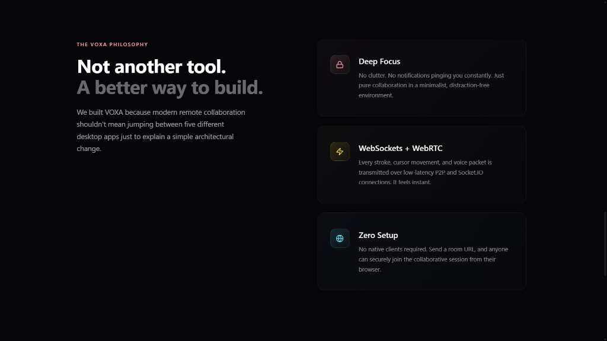
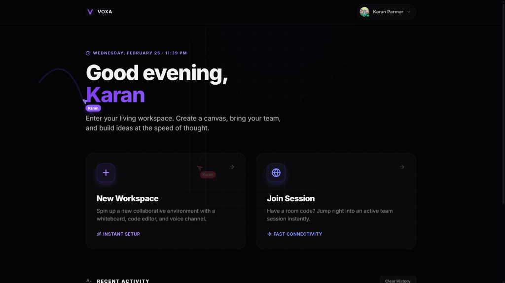
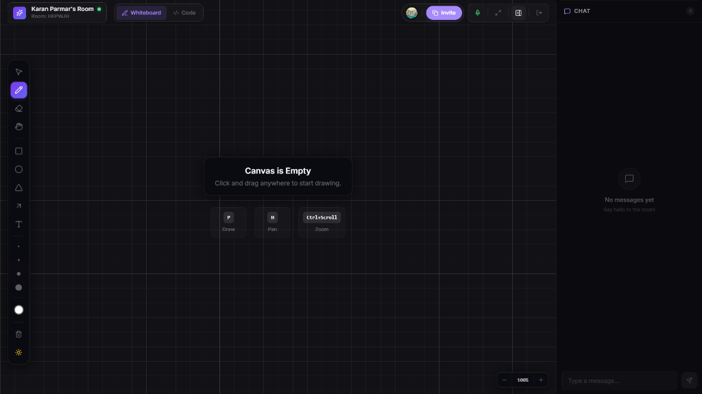
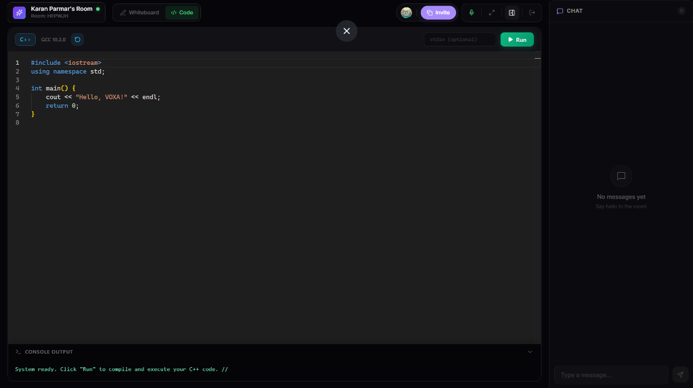

<div align="center">
  <h1>VOXA</h1>
  <p><strong>Where teams think together.</strong></p>
  <p>A real-time collaborative workspace featuring an infinite whiteboard, code editor, live chat, and voice communication.</p>

  <div>
    <a href="https://voxa-client-77mw.onrender.com/"></a>
    
    
    
    
  </div>
</div>

---

## 🌟 Overview

VOXA is a production-grade, real-time collaboration platform designed for engineers, designers, and remote teams who need to think, design, and build together. It seamlessly integrates visual brainstorming, coding, and communication into a single, cohesive environment. 

Forget jumping between multiple apps—VOXA brings your entire workflow into one room.

### 🖼️ Screenshots

<details open>
<summary><b>Landing Page</b></summary>

</details>

<details>
<summary><b>Philosophy & Features</b></summary>

</details>

<details>
<summary><b>Dashboard</b></summary>

</details>

<details>
<summary><b>Collaborative Whiteboard</b></summary>

</details>

<details>
<summary><b>Real-time Code Editor</b></summary>

</details>


## ✨ Key Features

*   **🎨 Infinite Whiteboard:** High-performance, zoomable, and pannable canvas powered by Fabric.js. Draw, add shapes, text, and sticky notes with live cursor tracking. Includes undo/redo and custom themes.
*   **💻 Real-time Code Editor:** A Monaco-based IDE directly in your browser. Supports syntax highlighting, multi-cursor collaborative editing, and live execution.
*   **🤖 AI-Powered Diagrams:** Generate complex Mermaid.js architecture diagrams instantly from text descriptions using Google's Gemini AI.
*   **💬 Integrated Chat:** Low-latency text chat synchronized per room, ensuring context is never lost.
*   **🎙️ P2P Voice Channels:** Built-in WebRTC voice communication. No need for third-party meeting links; talk naturally while you work.
*   **⚡ Sub-50ms Sync:** Instantaneous state synchronization across all connected clients via optimized WebSockets (Socket.IO).
*   **🔐 Secure Authentication:** Seamless Google OAuth and JWT-based email/password authentication via Passport.js.
*   **💾 Persistent Workspaces:** All whiteboard objects, code, and chat history are saved in real-time to MongoDB, ready whenever you return.

## 🏗️ Technology Stack

VOXA is built on a modern MERN stack, heavily optimized for real-time performance.

### Frontend
*   **Framework:** React 19 + Vite (Ultra-fast HMR and optimized builds)
*   **Styling:** Custom CSS + Tailwind CSS (Utility-first) + Framer Motion (Fluid animations)
*   **Canvas Engine:** Fabric.js (Object model wrapper for HTML5 canvas)
*   **Code Editor:** `@monaco-editor/react` (VS Code's core editor)
*   **Visualizations:** React Three Fiber / Drei (3D elements), Mermaid.js (Diagrams)

### Backend & Real-time
*   **Server:** Node.js + Express 5
*   **Real-time Engine:** Socket.IO v4 (WebSockets with polling fallback)
*   **Voice/Video:** `simple-peer` (WebRTC P2P mesh network)
*   **Authentication:** Passport.js (Google OAuth20) + JWT

### Database & AI
*   **Database:** MongoDB Atlas (Mongoose ODM)
*   **AI Integration:** Google Generative AI (`@google/generative-ai` - Gemini Pro)

## ⚙️ System Architecture

1.  **Client Layer:** React application served statically. Manages local UI state and captures high-frequency user inputs (mouse moves, keystrokes, canvas events).
2.  **Socket Layer:** A dedicated Socket.IO handler manages 'Rooms'. It broadcasts `draw-data`, `code-change`, `cursor-move`, and `chat-message` events to all peers in the room. High-frequency volatile events (like live cursors) are optimized to prevent server choke.
3.  **Signaling Server (WebRTC):** The Node server acts as a signaling bridge, passing SDP offers/answers and ICE candidates between clients to establish direct P2P mesh connections for voice chat.
4.  **Persistence Layer:** Background workers (or asynchronous event handlers) periodically batch-save the room's current state (whiteboard object array, code string, chat history) to MongoDB to ensure data durability without blocking the main event loop.

### How AI Diagram Generation Works
The client sends a natural language prompt to the Node server. The server constructs a strict prompt requesting *only* Mermaid.js syntax and forwards it to the Gemini API. The response is parsed, validated, and broadcasted via WebSockets to all clients, where the Mermaid React component renders the SVG simultaneously for everyone.

## 🚀 Installation & Local Setup

### Prerequisites
*   Node.js (v18+)
*   MongoDB Instance (Local or Atlas)
*   Google Cloud Console Project (for OAuth)
*   Google AI Studio API Key (for Gemini)

### 1. Clone the repository
```bash
git clone https://github.com/KaranParmar19/Voxa.git
cd Voxa
```

### 2. Backend Setup
```bash
cd server
npm install
```

Create a `.env` file in the `/server` directory:
```env
PORT=5001
MONGO_URI=mongodb+srv://<user>:<password>@cluster.mongodb.net/voxa
JWT_SECRET=your_super_secret_jwt_key
CLIENT_URL=http://localhost:5173
SERVER_URL=http://localhost:5001
GOOGLE_CLIENT_ID=your_google_client_id
GOOGLE_CLIENT_SECRET=your_google_client_secret
GEMINI_API_KEY=your_gemini_api_key
NODE_ENV=development
```

Start the development server:
```bash
npm run dev
```

### 3. Frontend Setup
```bash
# Open a new terminal
cd client
npm install
```

Create a `.env` file in the `/client` directory:
```env
VITE_SERVER_URL=http://localhost:5001
```

Start the Vite development server:
```bash
npm run dev
```

The app will be available at `http://localhost:5173`.

## 📂 Folder Structure

```text
Voxa/
├── client/                 # React Frontend
│   ├── public/             # Static assets & _redirects (SPA routing)
│   ├── src/
│   │   ├── assets/         # Images, icons, SVGs
│   │   ├── components/     # Reusable UI (Chat, CodeEditor, Whiteboard)
│   │   ├── context/        # React Context API (Auth, Theme)
│   │   ├── hooks/          # Custom React hooks
│   │   ├── pages/          # Route components (Home, Dashboard, Room, Auth)
│   │   ├── services/       # Axios API client setups
│   │   └── utils/          # Helper functions (snapping, math)
│   ├── package.json
│   └── vite.config.js
├── server/                 # Node.js Backend
│   ├── src/
│   │   ├── config/         # DB connection, Passport Auth config
│   │   ├── controllers/    # Route logic (Auth, Rooms)
│   │   ├── middleware/     # JWT verification guards
│   │   ├── models/         # Mongoose Schemas (User, Room)
│   │   ├── routes/         # Express API endpoints
│   │   ├── socket/         # Socket.IO event handlers
│   │   └── index.js        # Entry point
│   └── package.json
├── render.yaml             # Render deployment configuration
└── README.md
```

## 📈 Performance & Optimization

*   **Render Throttling:** Live cursors and high-frequency whiteboard drawing events use `socket.volatile.emit` to drop frames on slow connections rather than building up lag.
*   **State Management:** React components are carefully decoupled. The whiteboard state lives outside standard React state via Fabric.js instances to prevent unnecessary React re-renders during active drawing.
*   **SPA Fallback:** Implemented robust `_redirects` and `render.yaml` rewrite rules to handle Client-Side Routing correctly on static hosting providers.

## 🚢 Deployment

VOXA is configured for seamless deployment on [Render](https://render.com).

1.  Connect your GitHub repository to Render.
2.  Render will automatically detect the `render.yaml` Blueprint file.
3.  It will create two services:
    *   `voxa-server` (Web Service, Node)
    *   `voxa-client` (Static Site, Vite)
4.  Navigate to the **Environment** tab of `voxa-server` on the Render dashboard and securely input your `.env` variables (MongoDB URI, Google OAuth keys, etc.).
5.  Render handles the CI/CD pipeline and will deploy both services automatically on push.

## 🛣️ Future Roadmap

*   [ ] **Custom Authentication Providers:** Add GitHub and Microsoft login options.
*   [ ] **Code Execution Sandboxing:** Secure, isolated containers (e.g., Docker/Piston) for executing user code server-side safely.
*   [ ] **Export Capabilities:** Export whiteboard canvases as high-res PNG/SVG or PDF.
*   [ ] **Room Access Controls:** Add password protection and waiting rooms for collaborative sessions.
*   [ ] **Video Support:** Upgrade WebRTC implementation to support webcam video streams alongside voice.

## 🤝 Contributing

Contributions are welcome! If you'd like to improve VOXA, please follow these steps:

1.  Fork the repository.
2.  Create a feature branch: `git checkout -b feature/AmazingFeature`
3.  Commit your changes: `git commit -m 'Add some AmazingFeature'`
4.  Push to the branch: `git push origin feature/AmazingFeature`
5.  Open a Pull Request.

## 📄 License

Distributed under the MIT License. See `LICENSE` for more information.

---
<div align="center">
  <p>Built with ❤️ for teams that build.</p>
</div>
